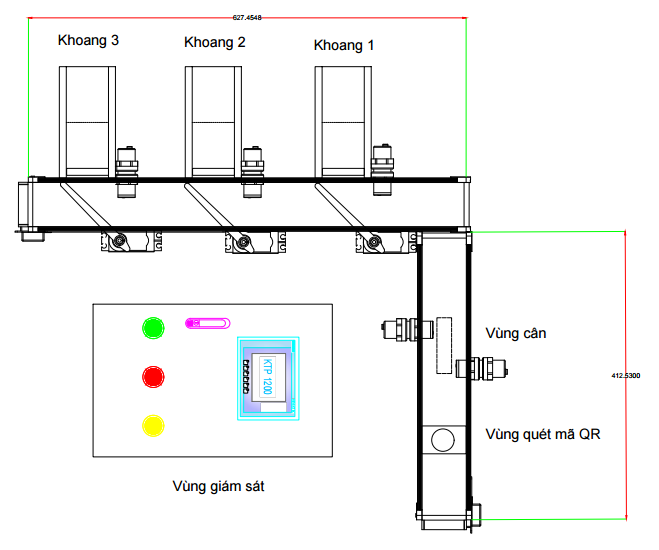
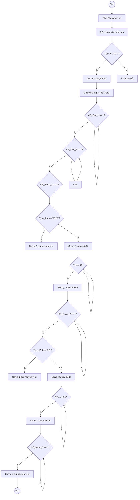
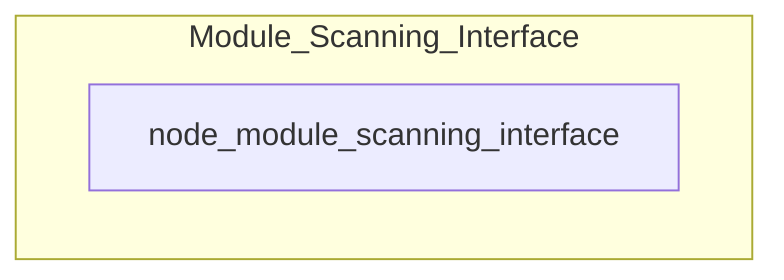
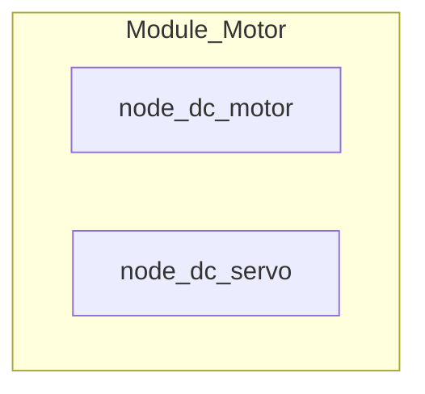
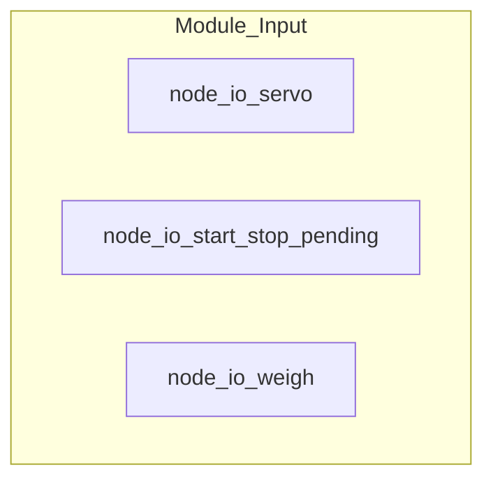
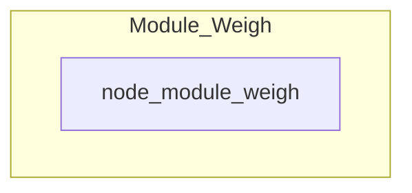
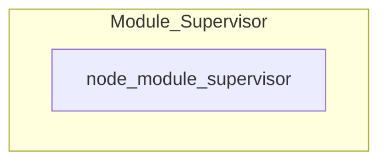
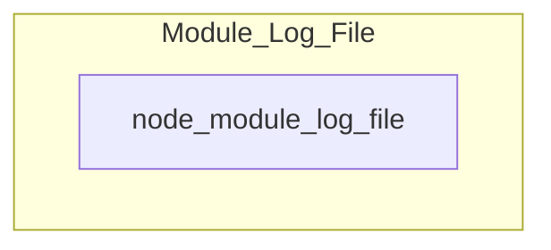
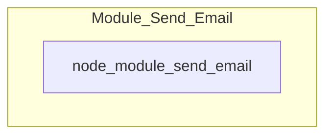

# DATN_ROS - Đồ án tốt nghiệp đề tài phân loại sản phẩm theo mã QR và cân nặng sử dụng ROS2 Communication

## A. Mục tiêu
   * [ ] Phân loại được 3 loại sản phẩm
   * [ ] Phân loại sản phẩm nhanh chóng, chính xác
   * [ ] Giao diện giám sát tại hiện trường trực quan
   * [ ] Dễ bảo trì, nâng cấp
## B. Sơ đồ biểu diễn công nghệ và lựa chọn phần cứng
- Sơ đồ biểu diễn công nghệ:
  
- Lựa chọn phần cứng:
  |Số thứ tự|Tên thiết bị
  |---|---|
  |1.|DC Motor XGB-385SAP|
  |2.|Servo Motor 995|
  |3.|Bridge H Circuit L298N|
  |4.|Photo Electric Sensor NPN Type E3F-DS10C4|
  |5.|Loadcell YZC-133|
  |6.|Converter Module HX711|
  |7.|Button|
  |8.|Raspberry PI 4B|
  |9.|Module Camera|
  |10.|HMI5001|
  |11.|5V 10A Power Supply|
  |12.|24V 5A Power Supply|
  |13.|Aptomat BKN C16|
## C. Lưu đồ thuật toán tổng quan

- Chú thích:
  * Servo_n: Servo thứ n
  * CB_Can_n: Cảm biến cho vùng cân thứ n
  * Type_Prd: Chủng loại sản phẩm sau khi truy xuất ID sản phẩm
  * CB_Servo_n: Cảm biến dùng cho việc phân loại kết hợp với servo thứ n
  * Tn: Timer thứ n
## D. Thiết kế chương trình sử dụng ROS2 Framework
### I. Lý do lựa chọn
* Dễ bảo trì, nâng cấp
* Độ trễ thấp
* Sử dụng DDS làm hệ thống middleware -> thuận lợi việc truyền thông giữa các chức năng
### II. Thiết kế hệ thống
#### 1. Phân bổ bố cục và chức năng của từng Packages
##### a) Module Scanning Interface

- Trong đó:
  * Module_Scanning_Interface: Nhóm chức năng dùng để quét mã QRCode, thực hiện chức năng truy vấn CSDL và hiển thị giao diện trực quan cho người dùng được đóng gói thành 1 Package
  * node_module_scanning_interface: 1 đơn vị chức năng (node) dùng để quét mã QRCode, thực hiện chức năng truy vấn CSDL và hiển thị giao diện trực quan cho người dùng
##### b) Module Motor

- Trong đó:
  * Module_Motor: Nhóm chức năng dùng để điều khiển động cơ được đóng gói thành 1 Package
  * node_dc_motor: 1 đơn vị chức năng (node) dùng để điều khiển động cơ DC
  * node_dc_servo: 1 đơn vị chức năng (node) dùng để điều khiển động cơ servo
##### c) Module_Input

- Trong đó:
  * Module_Input: Nhóm chức năng nhận tín hiệu đầu vào từ cảm biến và nút nhấn được đóng gói thành 1 Package
  * node_io_servo: 1 đơn vị chức năng (node) dùng để nhận tín hiệu từ cảm biến trong vùng phân loại
  * node_io_start_stop_pending: 1 đơn vị chức năng (node) dùng để nhận tín hiệu từ nút nhấn Start (xanh), Stop (đỏ) và Pending (vàng)
  * node_io_weigh: 1 đơn vị chức năng (node) dùng để nhận tín hiệu từ cảm biến trong vùng cân
##### d) Module_Weigh

- Trong đó:
  * Module_Weigh: Nhóm chức năng thực hiện nhiệm vụ cân được đóng gói thành 1 Package
  * node_module_weigh: 1 đơn vị chức năng (node) thực hiện nhiệm vụ cân
##### e) Module_Supervisor

- Trong đó:
  * Module_Supervisor: Nhóm chức năng thực hiện nhiệm vụ thực hiện kết nối các Packages, thực thi hủy, khởi tạo hệ thống được đóng gói thành 1 Package
  * node_module_supervisor: 1 đơn vị chức năng (node) thực hiện kết nối các Pạckages, thực thi hủy, khởi tạo hệ thống
##### f) Module_Log_File

- Trong đó:
  * Module_Log_File: Nhóm chức năng thực hiện nhiệm vụ tạo file log hệ thống được đóng gói thành 1 Package
  * node_module_log_file: 1 đơn vị chức năng (node) thực hiện nhiệm vụ tạo file log hệ thống
##### g) Module_Send_Email

- Trong đó:
  * Module_Send_Email: Nhóm chức năng thực hiện nhiệm vụ gửi mail cho các admin đính kèm file log đã nén được đóng gói thành 1 Package
  * node_module_send_email: 1 đơn vị chức năng (node) thực hiện nhiệm vụ gửi mail cho các admin đính kèm file log đã nén
#### 2. Liệt kê các custom services và topic
##### a) Service
- Các Service này được dùng cho việc thực hiện nhiệm vụ thực hiện kết nối các Packages, thực thi hủy, khởi tạo hệ thống được đóng gói thông qua node_module_supervisor

|Service|Client|Thuộc Node|
|---|---|---|
|node_io_servo|node_module_supervisor|node_io_servo|
|node_io_start_stop_pending|node_module_supervisor|node_io_start_stop_pending|
|node_io_weigh|node_module_supervisor|node_io_weigh|
|module_scanning_interface|node_module_supervisor|node_module_scanning_interface|
|module_send_email|node_module_supervisor|node_module_send_email|
|module_weigh|node_module_supervisor|node_module_weigh|
|node_dc_motor|node_module_supervisor|node_dc_motor|
|node_dc_servo|node_module_supervisor|node_dc_servo
##### b) Topic
 * /set_start_stop_pending
 * /weigh_io
 * /servo_io
 * /terminate
 * /rotate_servo
 * /sendfilename
 * /get_weigh  
#### 3. Lưu đồ thuật toán
#### 4. Kết quả mô hình
### III. Nhiệm vụ cần làm
#### 1. Module Supervisor
-    [x] Hoàn thành
#### 2. Module Scanning&Interface
-    [x] Tạo khung giao diện
-    [x] Bổ sung thêm phần Camera phân loại QR
-    [x] Bổ sung phần kết nối CSDL
-    [x] Kiểm tra CSDL
-    [x] Hiển thị bảng với thông tin sản phẩm
-    [x] Phần bổ sung khác
#### 3. Module Motor
-    [x] Bật Motor_DC và tắt Motor_DC khi hệ thống làm việc với trạng thái tương ứng
-    [x] Motor Servor phân loại đồng bộ với Module_Input và Module_Scanning&Interface 
#### 4. Module Input
-    [x] Đặt trạng thái Enable, Disable cân thông qua 2 cảm biến
-    [x] Lấy dữ liệu cảm biến IO_Cân
-    [x] Lấy dữ liệu cảm biến IO_Phanloai
-    [x] Bổ sung node_io_start_stop_pending
#### 5. Module Weigh
-    [x] Kích hoạt cân khi có trạng thái Enable
-    [x] Gửi dữ liệu cân
#### 6. Module Log File
-    [x] Log file khi chạy xong chương trình hoặc khi chương trình bị hủy
#### 7. Module Send Email
-    [x] Gửi file log qua email khi hệ thống bị ngắt đột ngột
-    [x] Gửi cho nhiều email
## E. Kết quả
- Link video: https://1drv.ms/v/c/0d0a136c0fdbc8e1/EavUMjfRviBKv5-fYtp7YnkBD-1rorZhIrqykVHdUnKdUQ?e=qp90eI
